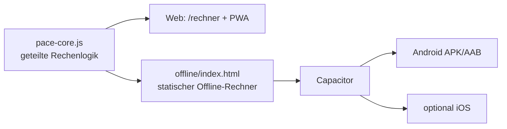

# PACEr als App und Offline-Nutzung

Ziel dieses Dokuments: Entscheidungsgrundlage, wie PACEr als installierbare bzw. offline-faehige App bereitgestellt werden kann. Es werden **Option A (PWA)** und **Option C (Capacitor, echte Offline-App)** dokumentiert. Eine Entscheidung wird hier bewusst noch nicht getroffen.

Eine dritte Variante (Option B: TWA/PWABuilder, duenne Play-Store-Huelle um die gehostete Seite) wird der Vollstaendigkeit halber kurz erwaehnt, aber nicht ausgearbeitet, weil sie weder "komplett offline ab Installation" noch deutlich einfacher als Option A ist.

## Was kann ueberhaupt offline gehen?

Grundlage ist die bereits umgesetzte Trennung der Rechenlogik in `PACEr/static/js/pace-core.js`. Diese Logik laeuft ohne Server und ist durch `tests/js/pace-core.test.js` abgesichert. Damit ist der Rechnerkern offline-faehig.

| Funktion | Komplett offline moeglich? | Begruendung |
|---|---|---|
| Auto-Rechner (BZ/EZ/HZ) | Ja | reine Berechnung in `pace-core.js` |
| Manueller Rechner | Ja | reine Berechnung in `pace-core.js` |
| Kilometer-Splits anzeigen | Ja | clientseitig berechnet/gerendert |
| Drucken / PDF | Teilweise | Browser-Druck offline ok; Server-PDF (`/api/export/pdf`) braucht Netz |
| Turnierverwaltung | Nein | DB-gebunden (Server) |
| OCR Foto-Erkennung | Nein | Server-/API-gebunden |
| Admin, Statistik, gespeicherte Berechnungen | Nein | Server-/DB-gebunden |

Kernaussage: Der Rechner (das eigentliche Turnier-Werkzeug) kann komplett ohne Internet laufen. Server-Features bleiben online.

---

## Option A: PWA (Progressive Web App)

Die Website selbst wird installierbar und nach dem ersten Laden offline nutzbar.

### Status im Repo

Bereits vorhanden:

- `PACEr/static/manifest.json` (Name, Icons 128/192, `start_url: /rechner`, `display: standalone`).
- `PACEr/static/sw.js` (Service Worker, Cache `pacer-offline-v2`, App-Shell-Precache, `network-first` fuer statische Assets, Admin-Pfade ausgenommen).
- Einbindung von Manifest + Service-Worker-Registrierung in `PACEr/templates/layout.html`.
- Abgesichert durch `tests/test_seo_routes.py` (Manifest verlinkt, SW im Root-Scope, Ladereihenfolge `pace-core.js` vor `calculator.js`).

Damit ist Option A technisch zu ~90 % vorhanden.

### Wie es fuer den Nutzer aussieht

1. Nutzer oeffnet `https://pacer.j-rz.de/rechner` einmal mit Internet.
2. Browser bietet "Zum Startbildschirm hinzufuegen" / "App installieren" an.
3. Danach: Icon auf dem Homescreen, Start im Vollbild (`standalone`), Rechner funktioniert auch offline.

### Vorteile

- Kein Store, kein Build, keine Signierung, keine Gebuehr.
- Eine Codebasis (Web = App), automatische Updates beim naechsten Online-Besuch.
- iOS und Android gleichzeitig abgedeckt.

### Grenzen / offene Punkte

- **Erster Aufruf braucht einmal Internet** (Shell muss geladen/gecacht werden). Also nicht "komplett offline ab Installation".
- Kein Play-Store-Eintrag (keine Store-Auffindbarkeit, kein Store-Vertrauen).
- iOS-PWA-Einschraenkungen (kein Auto-Install-Prompt, manuelles "Zum Home-Bildschirm").
- Icon-Set noch unvollstaendig fuer beste Installierbarkeit:
  - empfohlen zusaetzlich `512x512` und ein `maskable`-Icon im Manifest.

### Aufwand (Restarbeit)

- Klein. Im Wesentlichen Politur:
  - `512x512`- und `maskable`-Icon ergaenzen und im `manifest.json` eintragen.
  - Optional: kurzer Offline-Hinweis-Banner im Rechner ("Du bist offline, Berechnung laeuft lokal").
  - Optional: HTMX lokal hosten statt CDN, damit auch Mode-Wechsel-Partials offline robuster sind (siehe Hinweis unten).

### Restrisiken

- HTMX wird aktuell vom CDN geladen. Offline funktionieren reine `pace-core.js`-Berechnungen, aber HTMX-getriebene Server-Partials nicht. Fuer eine saubere Offline-PWA HTMX lokal bundeln oder die Offline-Pfade rein clientseitig halten.

---

## Option C: Capacitor (echte, komplett offline Smartphone-App)

Eine eigenstaendige Android-App (spaeter optional iOS), die **ab Installation ohne jegliches Internet** funktioniert und Play-Store-faehig ist. Das passt am genauesten zu "Download, der komplett ohne Internet funktioniert".

### Grundidee

Wir bauen ein kleines, eigenstaendiges statisches Offline-Paket, das **nur den Rechner** enthaelt, und verpacken es mit [Capacitor](https://capacitorjs.com/) zu einer nativen App. Kein Flask, kein HTMX, kein Server im Paket. Die App buendelt HTML + CSS + `pace-core.js` lokal.



Wichtig: `pace-core.js` wird **einmal** gepflegt und sowohl von der Website als auch von der App genutzt. Dadurch bleibt die Logik konsistent und bleibt durch `tests/js/pace-core.test.js` abgesichert.

### Was die App enthaelt

- Auto-Rechner (BZ/EZ/HZ) und manueller Rechner.
- Kilometer-Splits.
- Drucken/Teilen via natives Share/Print (z. B. als PDF ueber das Betriebssystem).
- Keine Turniere/OCR/Admin (bewusst, da serverabhaengig). Optional spaeter ein Button "Mehr Funktionen online oeffnen", der die Website laedt, wenn Internet da ist.

### Projektstruktur (Vorschlag)

```text
PACEr/
  app/                      # neues, separates App-Frontend (Offline-Bundle)
    www/
      index.html            # statischer Rechner (nutzt pace-core.js + eigenes minimal-css)
      pace-core.js          # Kopie/Build-Artefakt aus PACEr/static/js/pace-core.js
      app.css
      icons/...
    capacitor.config.json   # appId z. B. de.j-rz.pacer
    package.json            # @capacitor/core, @capacitor/cli, @capacitor/android
    android/                # von Capacitor generiert (gitignored bis auf Konfig)
```

Empfehlung: `pace-core.js` bleibt Single Source unter `PACEr/static/js/`. Ein kleines Build/Copy-Script kopiert sie nach `app/www/`, damit keine zwei divergierenden Kopien entstehen.

### Build-Pfad (Android, lokal)

Voraussetzungen: Node.js, Android Studio (SDK + Build-Tools), JDK 17.

```bash
# 1. App-Ordner initialisieren
cd PACEr/app
npm init -y
npm install @capacitor/core @capacitor/cli @capacitor/android

# 2. Capacitor anlegen (webDir = www)
npx cap init "PACEr" de.j-rz.pacer --web-dir=www

# 3. Android-Plattform hinzufuegen
npx cap add android

# 4. Web-Assets in das native Projekt syncen
npx cap sync android

# 5. In Android Studio oeffnen und APK/AAB bauen
npx cap open android
# Alternativ headless (Debug-APK):
cd android && ./gradlew assembleDebug
# Ergebnis: android/app/build/outputs/apk/debug/app-debug.apk
```

Ergebnis: eine `.apk` (direkt verteilbar) bzw. `.aab` (fuer Play Store). Diese App startet komplett offline, weil alle Assets im Paket liegen.

### Verteilung

Zwei Wege, unabhaengig voneinander moeglich:

1. **Direkt-APK** (ohne Store): per Link/QR auf Turnieren verteilen. Nutzer muss "Installation aus unbekannten Quellen" erlauben. Schnell, kostenlos, keine Store-Pruefung.
2. **Play Store** (`.aab`):
   - Google Play Console Entwicklerkonto: **einmalig ca. 25 USD**.
   - App-Signaturschluessel erzeugen und sicher verwahren (Verlust = keine Updates mehr moeglich).
   - Store-Eintrag: Datenschutzerklaerung, Screenshots, Kategorien, Altersfreigabe.
   - Review-Prozess von Google (Tage).
   - Optional spaeter iOS via App Store (Apple Developer Program: **99 USD/Jahr**), gleicher Capacitor-Code.

### Vorteile

- **Komplett offline ab Installation** (kein erster Online-Aufruf noetig).
- Echte App: Store-Listing, Vertrauen, Auffindbarkeit, App-Icon, Offline-Garantie.
- Logik geteilt mit der Website (`pace-core.js`), durch Tests abgesichert.
- iOS spaeter mit demselben Code moeglich.

### Grenzen / Aufwand

- Mehr Setup als Option A: Node-App, Capacitor, Android Studio/SDK, Signierung.
- Zwei Frontends zu pflegen (Website-Rechner + App-Rechner), gemildert durch gemeinsames `pace-core.js` + Copy-Script.
- Store-Veroeffentlichung kostet Geld (Play 25 USD einmalig, Apple 99 USD/Jahr) und erfordert Datenschutz-/Store-Pflichtangaben.
- Updates der App erfordern neuen Build + Store-Rollout (im Gegensatz zur PWA, die sich automatisch aktualisiert).

### Restrisiken

- Signaturschluessel-Verwaltung (Backup zwingend).
- Play-Store-Richtlinien (z. B. Datenschutzerklaerung Pflicht).
- Doppelte Logikpflege, falls das Copy-Script vergessen wird (Mitigation: Build-Schritt + ggf. CI-Check, der App-Kopie gegen `PACEr/static/js/pace-core.js` difft).

---

## Option B (nur zur Einordnung): TWA / PWABuilder

Mit PWABuilder/Bubblewrap wird die bestehende PWA als Android-App ("Trusted Web Activity") in den Play Store gepackt. Sieht aus wie eine App, laedt im Kern aber weiter von der gehosteten Seite.

- Pro: schneller Play-Store-Eintrag mit minimalem Aufwand.
- Contra: **nicht komplett offline ab Installation** (haengt an der gehosteten PWA), wenig Mehrwert gegenueber Option A bei gleichzeitig Store-Pflichten.

Daher hier nicht weiter ausgearbeitet.

---

## Vergleich auf einen Blick

| Kriterium | Option A: PWA | Option C: Capacitor |
|---|---|---|
| Komplett offline ab Installation | Nein (erster Aufruf online) | Ja |
| Play-Store-faehig | Nein | Ja (auch Direkt-APK) |
| Setup-Aufwand | Sehr klein (fast fertig) | Mittel |
| Laufende Kosten | Keine | Play 25 USD einmalig, iOS 99 USD/Jahr |
| Updates | Automatisch (online) | Neuer Build + Store-Rollout |
| Codebasis | Web = App | Web + App-Bundle (geteiltes `pace-core.js`) |
| iOS-Abdeckung | Eingeschraenkt (PWA) | Ja (gleicher Code) |
| Bester Anwendungsfall | Niedrige Huerde, schnelle Reichweite | "Echte" Offline-App fuer Turniere |

---

## Empfehlung (zur spaeteren Entscheidung)

- **Beides ist kombinierbar und schliesst sich nicht aus.**
- Kurzfristig **Option A** fertig poliessen (512px/maskable Icon, optional HTMX lokal) -> niedrigste Huerde, sofort Reichweite.
- Fuer "Download, der komplett ohne Internet funktioniert" -> **Option C** mit Capacitor.
  - Risikoarmer erster Schritt: statischer `offline/`-Rechner + lokal gebaute **Direkt-APK** (ohne Store-Veroeffentlichung), zum Testen und Verteilen per QR auf Turnieren.
  - Play-Store-Veroeffentlichung erst danach als bewusster, kostenpflichtiger Schritt.

## Naechste konkrete Schritte (wenn entschieden)

Fuer Option A:

1. `512x512`- und `maskable`-Icon erstellen, in `manifest.json` eintragen.
2. Optional Offline-Banner im Rechner.
3. Optional HTMX lokal hosten.

Fuer Option C:

1. Statischen Offline-Rechner `PACEr/app/www/index.html` bauen, der `pace-core.js` wiederverwendet.
2. Copy-/Build-Script `pace-core.js` -> `app/www/` einrichten.
3. Capacitor initialisieren, Android-Plattform hinzufuegen, Debug-APK bauen und auf einem Geraet im Flugmodus testen.
4. Erst danach: Signaturschluessel, `.aab`, Play-Console-Konto, Store-Eintrag.

## Offene Entscheidungen fuer den Nutzer

1. Reicht zunaechst Option A (installierbare PWA), oder soll Option C (echte Offline-App) umgesetzt werden?
2. Offline-App nur Rechner (Auto + Manuell + Drucken), ohne Turniere/OCR: bestaetigt?
3. PDF offline: Browser-/OS-Druck genuegt zunaechst, oder echter Client-PDF-Export gewuenscht?
4. Direkt-APK (QR-Verteilung) ausreichend, oder ist der Play-Store-Eintrag (mit Kosten/Pflichten) gewuenscht?
