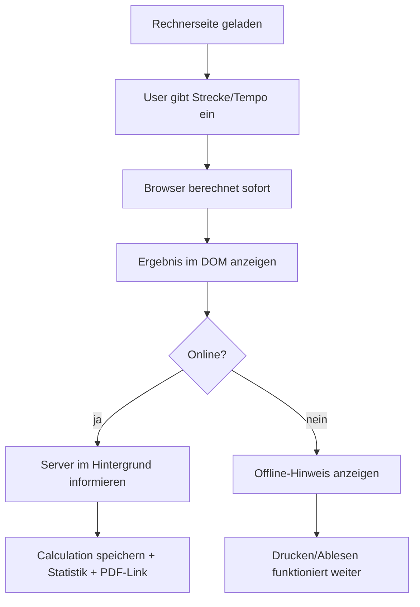

# Offline-first Rechner fuer PACEr

Ziel: Der Kernrechner soll auf Turnieren auch bei schlechtem oder fehlendem Internet sofort funktionieren. Flask bleibt die Server-App fuer Admin, Turniere, OCR, PDF, Speicherung und Statistik. Der Rechner wird schrittweise clientseitig/offline-first erweitert, ohne den bestehenden Server-Fallback sofort zu entfernen.

## Leitentscheidung

PACEr soll kein kompletter Offline-Klon werden. Stattdessen:

- Berechnung zuerst im Browser.
- Server bleibt Fallback und Komfortschicht.
- PDF, OCR, Admin und Turnierverwaltung bleiben zunaechst serverseitig.
- Offline-Nutzung soll transparent sein: Nutzer sehen, was offline geht und was erst online wieder moeglich ist.

## Aktueller Ist-Zustand

### Relevante Dateien

- `PACEr/helper.py`
  - `calculatePace(laenge, kmh, art)` berechnet BZ/EZ/HZ fuer Auto-Modus.
  - `pace(laenge, time_min, time_sec)` erzeugt Splitzeiten.
  - `oldPace(...)` ist alte kombinierte Logik, aktuell vermutlich nur historisch/redundant.
  - `writeStatistics()` schreibt Nutzungsstatistik in die DB.

- `PACEr/routes/calculator.py`
  - `/rechner` rendert Seite und Form.
  - `/api/calculate` gibt per HTMX Ergebnis-Partial zurueck.
  - `/api/export/pdf/<id>` erzeugt PDF serverseitig.
  - `/partials/form` liefert Auto-/Manuell-Formulare fuer Mode-Wechsel.
  - `/api/tournament-klassen` liefert Klassenauswahl fuer Turnier.
  - `_handle_calculation()` ist serverseitige Quelle fuer Berechnung, Speicherung, Statistik und Follow-up-Form.

- `PACEr/templates/partials/form_new.html`
  - Auto-Formular.
  - HTMX-Submit an `/api/calculate`.
  - Optional Turnierzuordnung mit HTMX fuer Klassen.

- `PACEr/templates/partials/form_old.html`
  - Manuell-Formular.
  - HTMX-Submit an `/api/calculate`.
  - Optional Turnierzuordnung.

- `PACEr/templates/partials/results.html`
  - Server gerendertes Ergebnis.
  - Erwartet `ez_result`, `hz_result`, optional `bz_result`, `calculation_id`, `followup_form_url`.
  - PDF-Link nur bei vorhandener gespeicherter Calculation.

- `PACEr/static/js/calculator.js`
  - Aktuell Validierung, Slider, Mode-UI, HTMX-Zustand.
  - Noch keine Fachberechnung.

- `PACEr/templates/calculator/rechner.html`
  - Laedt `calculator.js`.
  - Form-/Sidebar-Struktur.

- `PACEr/templates/layout.html`
  - Noch kein Manifest/Service Worker.

- `package.json`
  - Nur Tailwind-Scripts. Kein JS-Testframework.

### Noch nicht vorhanden

- Service Worker.
- Web App Manifest.
- Offline-Cache-Strategie.
- Clientseitige Berechnungslogik.
- JS-Tests.
- Sync-/Queue-Mechanismus fuer spaeteres Speichern.

## Zielbild

## Umsetzungsphasen

### Phase 1: Rechenlogik isolieren und absichern

Ziel: Python und JS liefern identische Ergebnisse.

Aenderungen:

- Neue Datei: `PACEr/static/js/pace-core.js`
  - Reine Funktionen ohne DOM:
    - `pace(lengthMeters, minutes, seconds)`
    - `calculatePace(lengthMeters, kmh, type)`
    - `calculateAuto(input)`
    - `calculateManual(input)`
    - `formatTimePart(value)` optional
  - Export kompatibel fuer Browser und Node/CommonJS, damit Tests ohne Browser laufen koennen.

- Optional Python-Refactor:
  - `helper.py` fachlich nicht veraendern.
  - Nur falls noetig sprechendere Tests ergaenzen.

- Neue Tests:
  - `tests/test_pace_logic.py` fuer Python-Golden-Master.
  - `tests/js/pace-core.test.js` oder simples Node-Testscript.
  - `package.json` Script z. B. `test:js`.

Validierung:

- Auto-Modus:
  - Wegstrecke 4900m 13 km/h.
  - Hindernisstrecke 5000m 12 km/h.
  - Schrittstrecke 1000m 6 km/h.
  - Strecke unter 1000m.
  - Strecke exakt 1000m.
  - Lange Strecke, z. B. 100000m.
- Manuell:
  - BZ/EZ/HZ mit Sekunden 0, 5, 59.
  - Strecke mit Restmetern, z. B. 4900m.
- Fehlerfaelle:
  - Laenge <= 0.
  - Laenge > 100000.
  - unbekannte Streckenart.
  - Sekunden > 59.

Fallstricke:

- Python `int()` rundet bei positiven Floats ab. JS muss `Math.trunc()` bzw. bei positiven Zahlen `Math.floor()` verwenden.
- Python gibt fuer Endstrecke im `pace()` die originalen `time_min`/`time_sec` zurueck, nicht neu formatiert. JS sollte numerisch konsistent sein.
- Reihenfolge der Splits muss stabil bleiben: 1000, 2000, ..., Endstrecke.
- Bei Strecken, die exakt auf 1000 enden, wird der Endwert im Python-Dict nochmals gesetzt. Effektiv bleibt ein Eintrag. JS darf keine Duplikatzeile erzeugen.
- `bz` kann bei Schrittstrecke `None/null` sein.
- BZ kann rechnerisch negativ werden, wenn Strecke/Tempo sehr kurz sind. Aktuell wird das serverseitig nicht explizit abgefangen. Das muss bewusst gleich bleiben oder fachlich neu entschieden werden.

### Phase 2: Clientseitiges Rendering als Progressive Enhancement

Ziel: Wenn JS verfuegbar ist, wird ohne Server-Request berechnet und angezeigt. Ohne JS oder bei Fehler funktioniert HTMX/POST weiter.

Aenderungen:

- `PACEr/static/js/calculator.js`
  - Submit-Handler fuer `.form-calculator` ergaenzen.
  - FormData lesen.
  - `pace-core.js` aufrufen.
  - Ergebnis-HTML clientseitig erzeugen.
  - Zielcontainer ersetzen, analog HTMX `hx-target`.
  - Follow-up-Button/Form klientseitig oder weiter per `/partials/form` wenn online.

- `PACEr/templates/calculator/rechner.html`
  - `pace-core.js` vor `calculator.js` laden.

- `PACEr/templates/partials/form_new.html` und `form_old.html`
  - Server-Fallback beibehalten: `action`, `method`, `hx-post` bleiben vorerst.
  - Optional `data-client-calculator="true"` setzen.
  - Optional `data-target-id` sauberer setzen.

- Neues clientseitiges Ergebnis-Rendering:
  - Entweder direkt String-Template in JS.
  - Oder verstecktes `<template>` im HTML.
  - Empfehlung: zuerst JS-Renderer, weil Ergebnisstruktur ueberschaubar ist. Spaeter ggf. Template vereinheitlichen.

Validierung:

- Browser-Test manuell:
  - Auto berechnen.
  - Manuell berechnen.
  - Ergebnis sieht mobil und desktop plausibel aus.
  - Server abschalten oder Offline-Modus im Browser aktivieren, nach bereits geladener Seite rechnen.
  - JS deaktivieren: Server-Fallback muss noch gehen.

Fallstricke:

- HTMX `beforeRequest` deaktiviert aktuell Submit-Button. Wenn clientseitig abgefangen wird, darf Button nicht haengen bleiben.
- Doppelte Berechnung vermeiden: `event.preventDefault()` und ggf. HTMX-Request verhindern.
- CSRF-Feld bleibt fuer Server-Fallback noetig.
- `calculation_id` existiert offline nicht. PDF-Link darf dann nicht angezeigt werden oder muss als „online speichern fuer PDF“ erscheinen.
- Follow-up-Forms brauchen eindeutige Ziel-IDs. Clientseitig generierte IDs duerfen nicht kollidieren.
- Bei Turnierzuordnung kann offline nicht sauber gespeichert werden.

### Phase 3: Server im Hintergrund weiter nutzen

Ziel: Online bleibt Komfort erhalten, offline bleibt Rechnung nutzbar.

Aenderungen:

- Neuer API-Endpunkt optional: `POST /api/calculations`
  - Nimmt Formdaten oder JSON entgegen.
  - Rechnet serverseitig erneut, validiert, speichert Calculation, schreibt Statistik.
  - Gibt JSON zurueck: `calculation_id`, `pdf_url`, ggf. `followup_form_url`.

Alternative:

- Bestehendes `/api/calculate` weiter nutzen und HTML parsen vermeiden.
- Besser: neuer JSON-Endpunkt, damit Client nicht von HTML-Partial abhaengt.

- `calculator.js`
  - Nach clientseitiger Anzeige bei `navigator.onLine` im Hintergrund speichern.
  - Wenn Antwort kommt: PDF-Link nachtraeglich einblenden.
  - Fehler still oder mit kleinem Hinweis behandeln.

Validierung:

- Online: Ergebnis erscheint sofort, PDF-Link kommt nach Serverantwort.
- Langsame Verbindung simulieren: Anzeige darf nicht warten.
- Serverfehler: Rechnung bleibt sichtbar, Hinweis „Speichern/PDF gerade nicht moeglich“.

Fallstricke:

- Server muss Berechnung erneut machen, nicht blind JS-Ergebnisse speichern. Sonst Manipulations-/Datenqualitaetsrisiko.
- Statistik darf nicht doppelt gezaehlt werden, wenn sowohl alter HTMX-Flow als auch neuer JSON-Flow aktiv ist.
- Turnierseiten zeigen nur gespeicherte Berechnungen. Offline-Berechnungen erscheinen dort nicht sofort.
- Race Conditions bei mehrfachem Klicken.

### Phase 4: Offline-App-Shell mit Service Worker

Ziel: `/rechner` und Assets sind nach erstem Besuch offline aufrufbar.

Aenderungen:

- Neue Datei: `PACEr/static/manifest.webmanifest`
  - Name, Short Name, Icons, Theme Color, Start URL `/rechner`.

- Neue Datei: `PACEr/static/sw.js`
  - Cache statischer Assets:
    - `/rechner`
    - CSS Build: `/static/build/theme.css?v=...` oder versionierter Cache.
    - `/static/js/pace-core.js`
    - `/static/js/calculator.js`
    - `/static/js/layout.js`
    - Logo/Icon Assets.
  - Strategie:
    - App-Shell: cache first mit Versionierung.
    - HTML `/rechner`: network first, fallback cache.
    - Sonstige GETs: network first oder pass-through.

- `PACEr/templates/layout.html`
  - Manifest-Link.
  - Service Worker registrieren, vermutlich nur in Produktion oder immer defensiv.

- Optional Route:
  - `/offline` als einfache Offline-Hilfeseite.

Validierung:

- Chrome DevTools Application:
  - Service Worker aktiv.
  - Cache enthaelt Rechnerseite und Assets.
  - Offline reload `/rechner` funktioniert nach erstem Besuch.
  - Berechnung funktioniert offline.

Fallstricke:

- HTMX wird von CDN geladen: `https://unpkg.com/htmx.org@2.0.4`. Offline fehlt HTMX, wenn nicht gecacht. Besser lokal vendorn oder Funktion ohne HTMX absichern.
- Google Fonts sind extern. Offline fallen sie aus. Das ist akzeptabel oder Fonts lokal hosten.
- Cache-Busting mit `asset_version`: Service Worker muss passende URLs kennen oder dynamisch cachen.
- Service Worker kann alte Assets hartnaeckig halten. Cache-Version sauber bumpen.
- Admin-Seiten nicht aggressiv cachen.
- CSRF/Session-Seiten nicht blind cachen.

### Phase 5: Offline-Hinweise und UX

Ziel: Nutzer verstehen den Zustand.

Aenderungen:

- `calculator.js`
  - Online/offline Listener.
  - Kleiner Badge: „Offline: Berechnung funktioniert, PDF/Speichern erst online“.
  - Bei gespeicherter Calculation: „PDF bereit“.

- Templates/CSS:
  - Komponente fuer Offline-Hinweis.

Validierung:

- Browser offline/online toggeln.
- Hinweis verschwindet/aktualisiert sich.

Fallstricke:

- `navigator.onLine` ist nicht 100% verlaesslich. Server-Save-Fehler muss trotzdem robust behandelt werden.
- Nutzer nicht nerven. Hinweis klein und hilfreich.

### Phase 6: PDF-Strategie

Moeglichkeiten:

1. Server-PDF behalten
   - Schnell, stabil, keine neue PDF-Bibliothek.
   - Offline kein PDF.

2. Druckansicht anbieten
   - Offline praktisch nutzbar.
   - `window.print()` und CSS `@media print`.
   - Nutzer kann auf vielen Geraeten als PDF speichern.

3. Client-PDF mit Bibliothek
   - Voll offline.
   - Mehr Abhaengigkeiten, Layoutaufwand, Testaufwand.

Empfehlung:

- Kurzfristig: Server-PDF + Offline-Druckansicht.
- Spaeter: echte Client-PDF nur, wenn Druckansicht nicht reicht.

Fallstricke:

- PDF im Turnierstress soll lesbar sein. Druckansicht muss mobil funktionieren.
- Client-PDF muesste Design und Seitenumbrueche nachbauen.
- Neue JS-Bibliothek vergroessert Offline-Cache.

### Phase 7: Turnierdaten offline optional cachen

Ziel: zuletzt geladene Turniere/Klassen auch offline verfuegbar.

Aenderungen:

- Neuer JSON-Endpunkt: `GET /api/tournaments/active`.
- Client speichert aktive Turniere in `localStorage` oder Cache API.
- Form kann offline mit zuletzt bekannten Daten arbeiten.

Validierung:

- Online Turniere laden.
- Offline Rechner oeffnen.
- Zuletzt bekannte Turniere auswählbar.

Fallstricke:

- Veraltete Turnierdaten.
- Offline zugeordnet, aber nicht gespeichert. Nutzer muss verstehen, dass Turnierseite erst online aktualisiert wird.
- Queue-Sync waere moeglich, aber Komplexitaet steigt.

## Sicherheits- und Datenqualitaetsprinzipien

- Browser-Ergebnis ist Komfort, nicht Autoritaet.
- Server rechnet bei Speicherung/PDF immer selbst erneut.
- CSRF fuer serverseitige POSTs behalten.
- Offline gespeicherte Daten nicht unbemerkt als offiziell behandeln.
- Admin, Reports, Login nicht offline cachen.

## Offene Produktentscheidungen vor Implementierung

1. Soll bei Offline-Berechnung ein PDF-Button als Druckfunktion erscheinen?
   - Empfehlung: Ja, als „Drucken / als PDF speichern“.

2. Soll eine Online-Berechnung weiterhin automatisch in der DB gespeichert werden?
   - Empfehlung: Ja, damit PDF und Turnierseiten wie bisher funktionieren.

3. Soll der alte HTMX-Submit dauerhaft als Fallback bleiben?
   - Empfehlung: Ja, mindestens bis Client-Rechner stabil ist.

4. Soll HTMX lokal gehostet werden, damit Mode-Wechsel auch offline stabil bleibt?
   - Empfehlung: Ja, spaeter in Phase 4. Fuer Phase 2 nicht zwingend, wenn Client-Submit unabhaengig funktioniert.

5. Soll Offline-Turnierzuordnung direkt mit Queue spaeter synchronisiert werden?
   - Empfehlung: Nein fuer den ersten Wurf. Erst nur berechnen, speichern/PDF bei Online.

6. Wie sollen negative Bestzeiten behandelt werden?
   - Ist-Zustand beibehalten oder fachlich abfangen?
   - Empfehlung: In Phase 1 exakt Ist-Zustand beibehalten, spaeter fachlich pruefen.

## Empfohlener erster Implementierungsschnitt

Minimal sinnvoller erster PR/Commit:

1. `pace-core.js` mit reiner JS-Logik.
2. JS-Golden-Master-Tests gegen bekannte erwartete Werte.
3. Python-Tests fuer dieselben Beispiele.
4. Noch keine UI-Aenderung.

Warum:

- Niedriges Risiko.
- Fachliche Gleichheit ist beweisbar.
- Danach kann UI/offline iterativ gebaut werden.

Zweiter Schnitt:

1. Clientseitiger Submit fuer Formulare.
2. Ergebnis-Renderer.
3. Server-Fallback bleibt.
4. Online Hintergrund-Save noch optional/ausgelassen.

Dritter Schnitt:

1. JSON-Speicher-Endpunkt.
2. PDF-Link nachtraeglich anzeigen.
3. Offline-Hinweis.

Vierter Schnitt:

1. Manifest.
2. Service Worker.
3. Lokales HTMX oder HTMX-unabhaengiger Mode-Wechsel.

## Akzeptanzkriterien Gesamtziel

- Nach einmaligem Laden kann `/rechner` offline geoeffnet werden.
- Auto-Modus berechnet offline korrekt.
- Manuell-Modus berechnet offline korrekt.
- Ergebnisse stimmen mit aktueller Python-Logik ueberein.
- Online bleibt PDF-Export moeglich.
- Ohne JS bleibt der bestehende Server-Fallback nutzbar.
- Admin/Login/Reports werden nicht offline gecacht.
- Nutzer bekommen klare Hinweise, wenn PDF/Speichern offline nicht verfuegbar ist.
